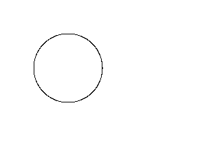
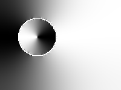
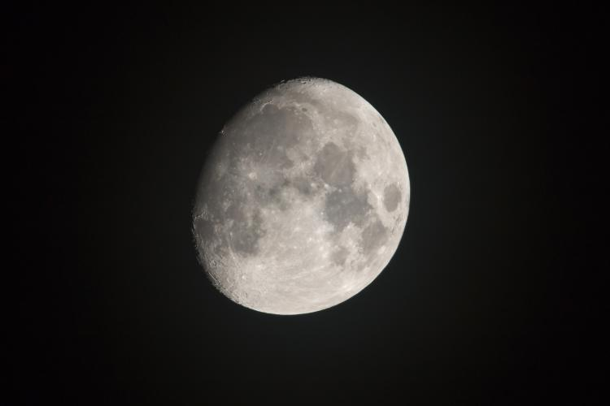
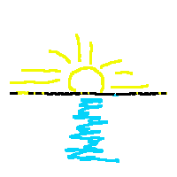
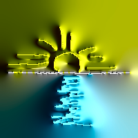
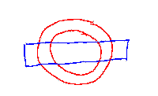
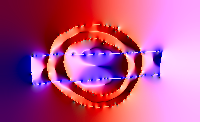

# color-GFHoG
Matlab implementation for Color Gradient Field Histogram of Oriented Gradient (Color GF-HoG) as described in 
the ICCV ws 2015 paper [Scalable Sketch-based Image Retrieval using Color Gradient Features](http://openaccess.thecvf.com/content_iccv_2015_workshops/w27/papers/Bui_Scalable_Sketch-Based_Image_ICCV_2015_paper.pdf) .
## GF-HoG implementation
 

<br>

 

<br><br>

If you work on black-white sketches only, please check [example.m](BW/example.m) under the BW folder:
```
des = ComputeGF('circle.png',0);
```
will compute local GF-HoG descriptors for a sketch. If you input an image, change the second argument to 1.

This implementation is follow the original C code by Rui Hu and Stuart James ([project page](http://personal.ee.surrey.ac.uk/Personal/R.Hu/SBIR.html)) with several improvements that achieves 16.6% mAP on the Flickr15K benchmark (18.2% mAP with Inverted Index), as reported in Fig. 5 in our paper.

### Color GF-HoG implementation
 

<br>

 

<br><br>

If you work on colour sketches, please check [example.m](color/example.m) under the color folder:
```
[des_shape, des_color] = ComputeGF_colour('underground_sketch.png',0);
```
will compute local shape and color descriptors for a sketch. For image, change the second argument to 1.

**Difference from the paper**
In the paper, the luminance channel (L*) is passed through a double sigmoid function to separate black and white from the rest. Our implementation currently employs L* directly. We will implement this functionality in the next update.

## Reference
```
@inproceedings{bui2015scalable,
  title={Scalable sketch-based image retrieval using color gradient features},
  author={Bui, Tu and Collomosse, John},
  booktitle={Proceedings of the IEEE International Conference on Computer Vision Workshops},
  pages={1--8},
  year={2015}
}
```